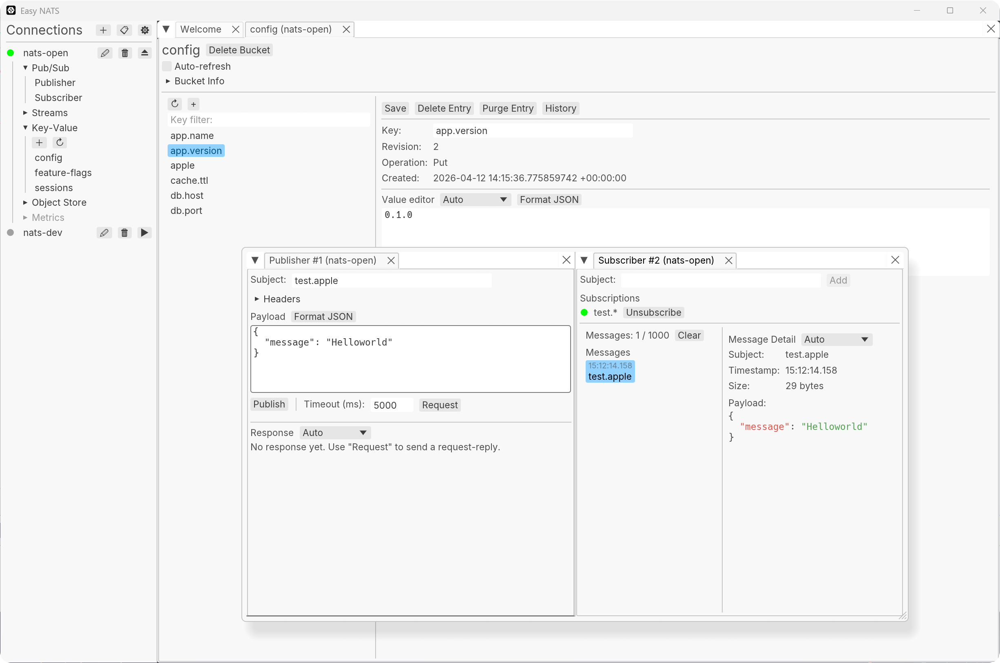

# Easy NATS

A cross-platform desktop GUI for [NATS](https://nats.io/) messaging, built with Rust.



## Features

- **Connection Management** — Multiple server profiles with support for no-auth, token, user/password, NKey, credentials file, and TLS client certificates. Profiles are persisted across sessions.
- **Publish / Subscribe** — Publish messages with headers, send request-reply with configurable timeout, subscribe to subjects with wildcard support (`*`, `>`), and browse messages in a real-time scrolling list.
- **Message Formatting** — Auto-detect JSON / UTF-8 / binary payloads with pretty-printed JSON, hex dump, and Base64 display modes. Manual format override per message.
- **JetStream Streams** — List, create, update, and delete streams. Browse stream messages with pagination and subject filter. Purge by subject or purge all. Delete individual messages.
- **JetStream Consumers** — List, create, and delete consumers per stream. View consumer info including pending, ack-pending, and redelivery counts.
- **Key-Value Store** — List, create, and delete KV buckets. Browse keys with filter, view/edit entry values, and inspect full revision history.
- **Object Store** — 🚧 Under construction.
- **Dockable Tabs** — Multi-tab workspace powered by egui_dock. Undock, rearrange, and tile tabs freely.
- **Dark / Light Theme** — Follow system preference or toggle manually. Preference is persisted.
- **Toast Notifications** — Non-blocking feedback for operation outcomes.

## Install

Pre-built binaries are available on the [Releases](https://github.com/mcthesw/easy-nats/releases) page.

**Windows (Scoop)**

```powershell
scoop bucket add sworld https://github.com/mcthesw/scoop-bucket
scoop install easy-nats
```

**macOS (Homebrew)**

```bash
brew install mcthesw/tap/easy-nats
xattr -dr com.apple.quarantine "/Applications/Easy NATS.app"
```

**Linux**

```bash
echo "deb [trusted=yes] https://mcthesw.github.io/sworld-apt stable main" | \
  sudo tee /etc/apt/sources.list.d/mcthesw.list
sudo apt update
sudo apt install easy-nats
```

For `.rpm` and `.AppImage`, use the [Releases](https://github.com/mcthesw/easy-nats/releases) page.

See [roadmap.md](roadmap.md) for additional distribution channels (Flathub, AUR, etc.).

## Build

Requires **Rust 2024 edition** (rustc 1.85+).

```bash
cargo build --release
```

The binary is output to `target/release/easy-nats` (or `easy-nats.exe` on Windows).

## License

[MIT](LICENSE)
