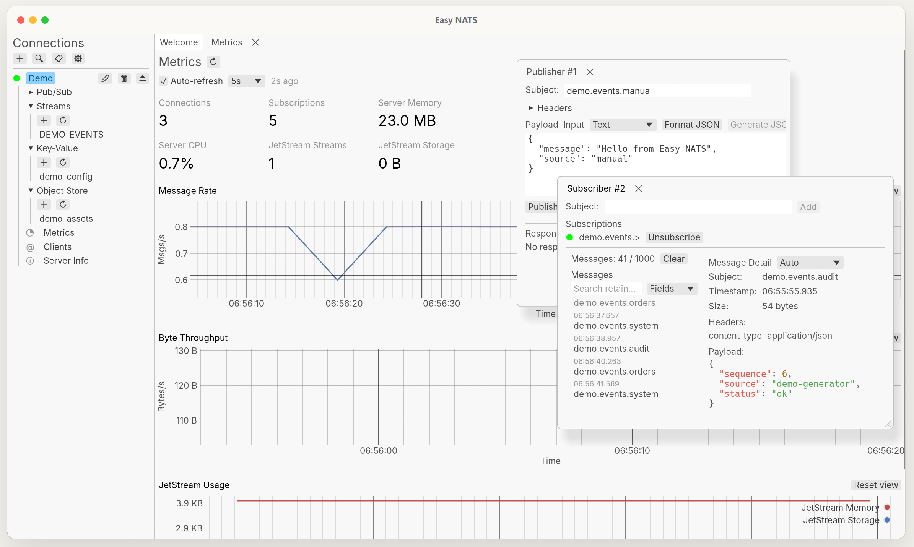
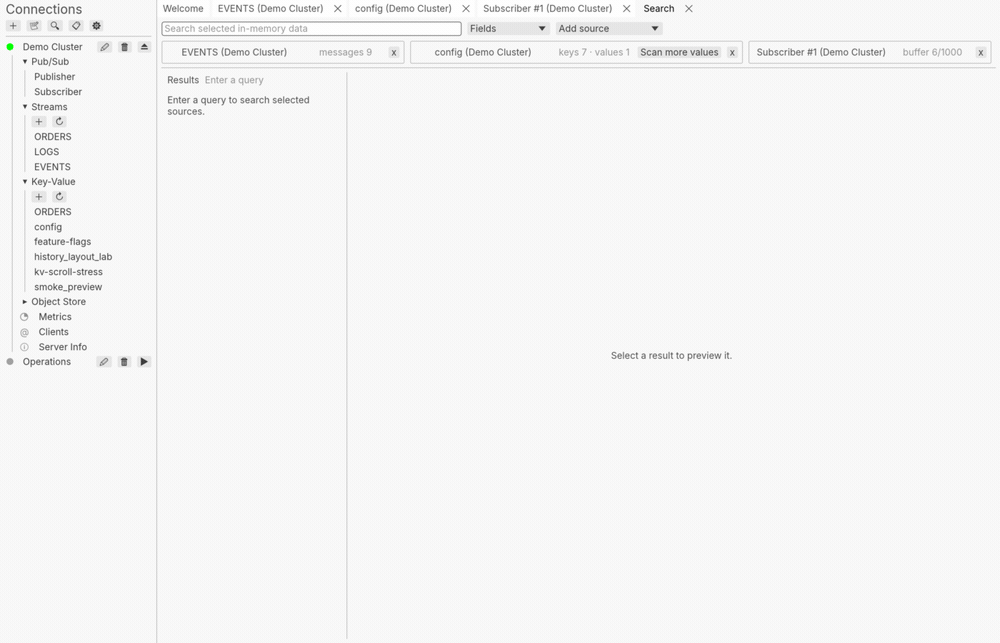
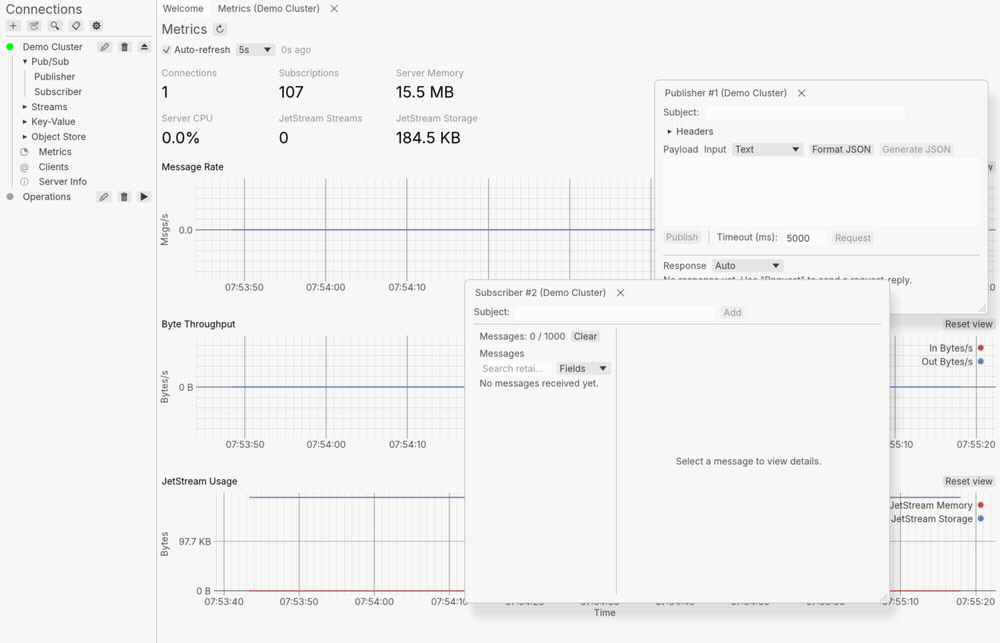
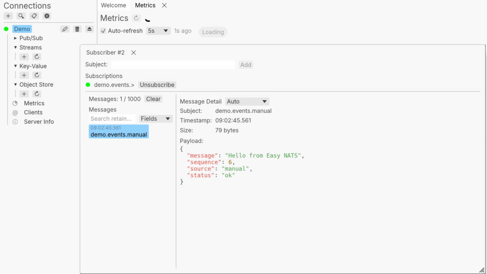

# Easy NATS

**A fast, native desktop workspace for [NATS](https://nats.io/).** It starts
quickly, stays responsive under live traffic, and keeps search, publishers,
subscribers, resources, and payload inspection in one workspace.

[Try the interactive preview](https://easy-nats.sworld.club) · [Download Easy NATS](#install)



## A workspace for real NATS work

### Search everything

Search across the open workspace. Every result
keeps its source and opens back at the original message or value instead of
leaving you to hunt for it again.



### Work in parallel

Dock windows into a focused layout or float a window when
you need to compare live traffic with the data you are editing.



### Inspect real payloads

Read JSON, MsgPack, Protobuf without leaving the app.



## Keyboard controls

Open **Commands** with **Ctrl+Shift+P** (macOS: **Cmd+Shift+P**) or the ⌘ button
beside Connections. Search in English or Chinese, use ↑/↓ to select, and press
Enter to run. Commands are grouped into Current Page, Navigation, Application, and Connections;
they show their shortcuts and explain when they are unavailable.
Search a saved connection's name and run **Open Connection: name** to connect without
using the sidebar. Connections already open or connecting are disabled.

| Action | Windows / Linux | macOS |
| --- | --- | --- |
| Search workspace | Ctrl+Shift+F | Cmd+Shift+F |
| New connection | Ctrl+N | Cmd+N |
| Close current tab | Ctrl+W | Cmd+W |
| Recent tabs in the focused split (release Control to switch) | Ctrl+Tab / Ctrl+Shift+Tab | Control+Tab / Control+Shift+Tab |
| Submit the current form | Ctrl+Enter | Cmd+Enter |
| Publisher request | Ctrl+Shift+Enter | Cmd+Shift+Enter |

The command palette includes **Switch to Tab…**, which searches open tabs across all
splits by tab name, connection, and subject. Ctrl+Tab opens the current split’s
recently used tabs; keep Control held to cycle, release it to switch, or press
Escape to cancel. A quick Ctrl+Tab returns to the last used tab.

Tab and Shift+Tab move between controls. Subject history uses ↑/↓ to select a
candidate; Enter accepts it without submitting. A subsequent Enter submits a
single-line form. Enter in a multiline editor inserts a newline. Esc closes the
innermost candidate list, command panel, or editor; it does not close a tab.
Deletion and purge are excluded from generic form submission. Closing an editor
or tab keeps the existing behavior: unsubmitted drafts are discarded.

## Install

Pre-built binaries are available on the [Releases](https://github.com/mcthesw/easy-nats/releases) page.

**Windows (Scoop)**

```powershell
scoop bucket add sworld https://github.com/mcthesw/scoop-bucket
scoop install easy-nats
```

**macOS (Homebrew)**

```bash
brew install --cask mcthesw/tap/easy-nats
xattr -dr com.apple.quarantine "/Applications/Easy NATS.app"
```

Upgrade:

```bash
brew upgrade --cask mcthesw/tap/easy-nats
xattr -dr com.apple.quarantine "/Applications/Easy NATS.app"
```

**Linux (APT)**

```bash
echo "deb [trusted=yes] https://mcthesw.github.io/sworld-apt stable main" | \
  sudo tee /etc/apt/sources.list.d/mcthesw.list
sudo apt update
sudo apt install easy-nats
```

**Linux (Flathub)**

[](https://flathub.org/zh-Hans/apps/io.github.mcthesw.easy-nats)

For `.rpm` and `.AppImage`, use the [Releases](https://github.com/mcthesw/easy-nats/releases) page.

See [roadmap.md](roadmap.md) for additional distribution channels (AUR, etc.).

## Build

Requires **Rust 2024 edition** (rustc 1.92+).

```bash
cargo build --release
```

The binary is output to `target/release/easy-nats` (or `easy-nats.exe` on Windows).

## License

[MIT](LICENSE)
